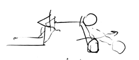
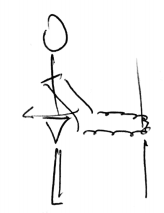
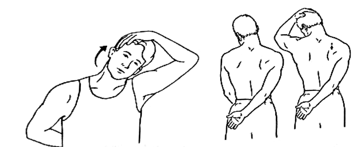
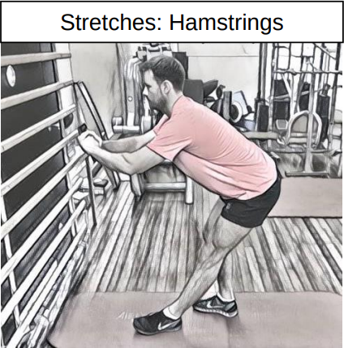

# physio

## shoulders

### ball || foam roller control

step hands out to a point you can control

### low row

1. set shoulders back
2. pull back

* elbows straight or slightly bent

### Band Reverse Fly

[youtube](https://www.youtube.com/watch?v=38leTE2y1I8)

### Press Up Against Wall

<video width=400 controls="controls">
  <source type="video/mp4" src="https://res.cloudinary.com/rehabguru/video/upload/vc_auto,q_auto/exercisevideos/277675016.mp4?ngsw-bypass"></source>
</video>

# hypertrophy

# stretching

## shoulders

### head push

Tilt your head to the side, rest your hand on your head and stretch for 30 seconds.

### head armpit push

Turn your head, look under your arm pit and take your hand to the back of your head and hold 30 secs again.

### hamstring stretch

